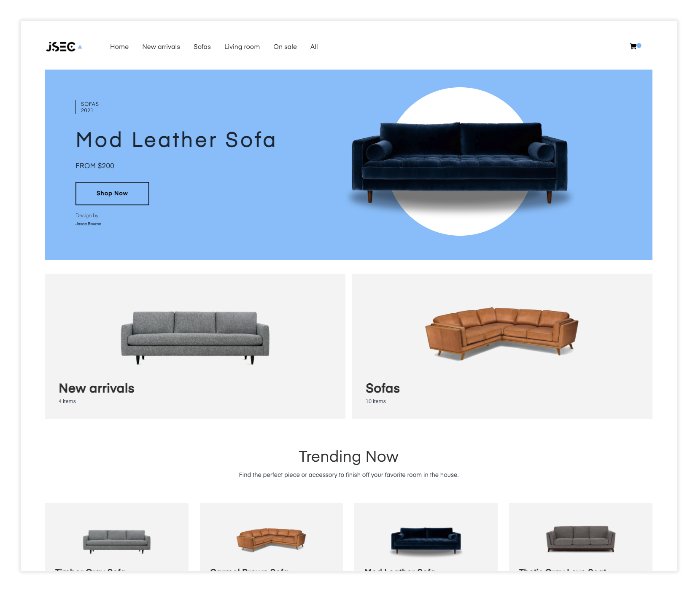
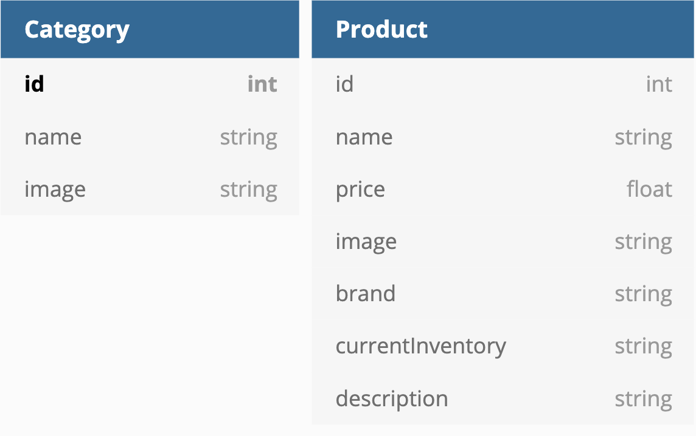
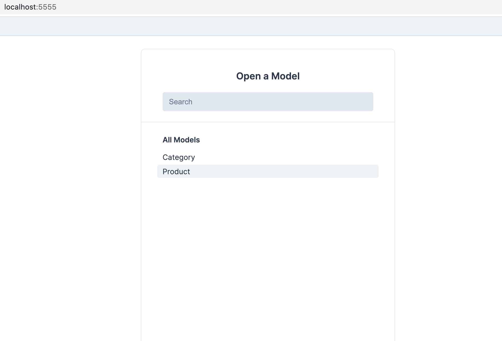
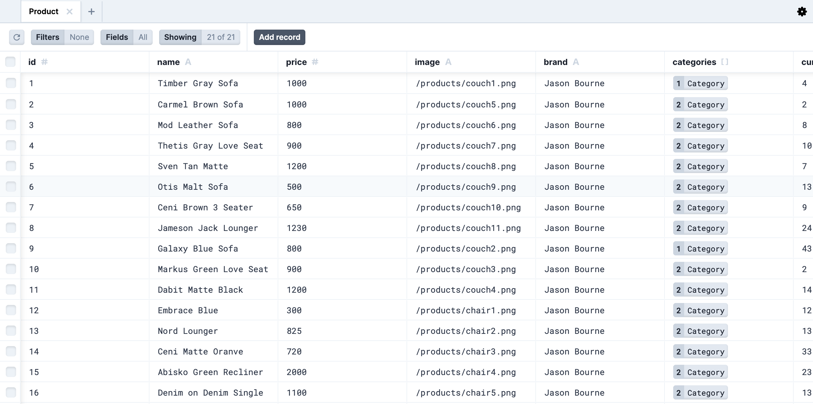

<p>In this tutorial, I will show you how you can build an app with Nextjs and Prisma. By the end, you will be able to;</p>

- Install and configure Prisma to point to an SQLite file ✅
- Model out your database schema and creating relationships ✅
- View your database structure along with data in it using Prisma's studio client ✅
- Seed (programmatically add sample) data to your database ✅
- Use Prisma Client to query for your data ✅
- Building dynamic routes with Nextjs ✅
- Using Static Site Generation(SSR) and Incremental Site Generation(ISG) with Nextjs ✅
- Configuring Prisma to use a Postgres database ✅
- Creating Migrations for your database ✅

**Note**: In this tutorial, we'll use an already built UI for an e-commerce app by my friend **Nader Dabit**. His app didn't have a backend, so that's what we'll be adding. Let's get started.

##### Initial setup

The first thing we want to do is clone Nader's repo and install dependencies. So go ahead and run this on your terminal;

```bash

git clone git@github.com:jamstack-cms/jamstack-ecommerce.git

```

Then move into the projects folder and run `yarn` to install the packages. After the installation, you can verify that you can run the app by running `yarn dev`. You should be able to open the application.



##### Installing and configuring Prisma

Next, we want to install the Prisma CLI as a dev dependency. We will do so by running `yarn add prisma --dev`

We will then use the newly installed Prisma CLI to instantiate some files that Prisma requires for us. We will do this by invoking the CLI by running `npx prisma init`

The above command will create a `.env` file and a `prisma` folder at the root of our project. The prisma folder will have a `schema.prisma` file; we will define our schema and configure our provider here, while in the env file, we'll store our sensitive database credentials.

We will configure Prisma to use SQLite provider by defining this in the datasource block in the `schema.prisma` file.

```prisma
// schema.prisma

datasource db {
  provider = "sqlite"
  url      = "file:./db"
}

generator client {
  provider = "prisma-client-js"
}

```

The above configuration tells Prisma that we want to use SQLite and the file name is `db` stored in our current directory. In this case, inside the prisma directory.

##### Schema Modeling

Next, we want to model the shape of our schema. Prisma provides a way to achieve this in a declarative way. But first, we need to have an idea of what tables and columns to declare. We want to have two tables; Category and Product.



I deduced this by inspecting the type of data our E-commerce app requires. At the moment, it has this data hardcoded under the `utils` folder.

Since now we have an idea of the shape of our data, we can go ahead and define the two models as depicted below in our `schema.prisma` file.

```
model Category {
  id            Int        @id
  name          String
  products      Product[]  @relation(references: [id])
  image         String?
}

model Product {
  id               Int        @id
  name             String
  price            Float
  image            String
  brand            String
  categories       Category[]  @relation(references: [id])
  currentInventory Int
  description      String
}

```

The above defines two models with some fields. The interesting bit is where we create relations between the two models. In the `Category` model, we define a `products` field which is an array of products. In the `Product` model, we have a `categories` field which is an array of categories.

This type of relation is a unidirectional type, where two models make references to each other. It is also a one-to-many relation for one product can appear in many categories, and one category can have many products in it.

It is also important to note that this connections **do not exist in the database**, they only exist at the Prisma level.

##### Viewing our Database structure

So far, we have defined our schema, and it would be nice to at least view this structure of our database. Prisma comes with a GUI that enables us to do precisely this. But first, we need to tell Prisma to update our model. To do this, we will run `npx prisma db push` which will create our SQLite database with the structure we defined. This file will be stored under the `prisma` folder.

Also note, since this is our first time running this command, Prisma CLI will do two additional things for us;

- It will install the Prisma client package since we don't have this installed already in our project.
- It will also generate a client for us, which is unique and based on our schema definition. We will use this to interact with our database later on.

And with that, we can now open prisma studio by running `npx prisma studio.`


We can view the two tables we specified but no data in them. Let's go ahead and address that next.

##### Seed our database

Before we add some data to our database, let's first install and configure our project to use typescript. This addition is not a requisite, but I'd highly recommend it for it will make our developer experience way better and prevent us from shipping preventable bugs. Prisma client will also infer our types.

Let's add the following packages as dev dependencies;
`yarn add typescript @types/node ts-node @types/react --dev`
Then let's add a `tsconfig.json` file in the root of our project with the following contents.

```json
{
  "compilerOptions": {
    "baseUrl": ".",
    "target": "es5",
    "lib": ["dom", "dom.iterable", "esnext"],
    "allowJs": true,
    "skipLibCheck": true,
    "strict": false,
    "forceConsistentCasingInFileNames": true,
    "noEmit": true,
    "esModuleInterop": true,
    "module": "commonjs",
    "moduleResolution": "node",
    "resolveJsonModule": true,
    "isolatedModules": true,
    "jsx": "preserve"
  },
  "include": ["next-env.d.ts", "**/*.ts", "**/*.tsx"],
  "exclude": ["node_modules"]
}
```

Then we need to add a compiler option in our scripts in our package.json file.

```json
"scripts": {
    ...
    "ts-node": "ts-node --compiler-options '{\"module\":\"CommonJS\"}'"
  },
```

This script will enable `prisma db seed` to work well with Nextjs's tooling.

Since we now have that out of the way, let's create a prisma client instance that we can reuse throughout our codebase. We will create a lib folder and add a `prisma-client.ts` file on there with the contents below.

```ts
import { PrismaClient } from "@prisma/client";

// add prisma to the NodeJS global type
interface CustomNodeJsGlobal extends NodeJS.Global {
  prisma: PrismaClient;
}

// Prevent multiple instances of Prisma Client in development
declare const global: CustomNodeJsGlobal;

const prisma = global.prisma || new PrismaClient();

if (process.env.NODE_ENV === "development") global.prisma = prisma;

export default prisma;
```

Let's then create a `data.ts` file under the `utils` folder. This file will contain some data to import and use the prisma client to insert into our database. Please copy and paste the data below into this file.

```js
interface ProductInterface {
  id: number
  name: string
  categories: number[]
  price: number
  image: string
  description: string
  currentInventory: number
  brand?: string
}

interface CategoryInterface {
  id?: number
  image?: string
  name: string
}

export const categories: CategoryInterface[] = [
  {
    id: 1,
    name: "new arrivals",
    image: "/products/couch1.png",
  },
  { id: 2, name: "sofas", image: "/products/couch5.png" },
  {
    id: 3,
    name: "living room",
    image: "/products/couch5.png",
  },
  {
    id: 4,
    name: "on sale",
    image: "/products/couch8.png",
  },
  {
    id: 5,
    name: "chairs",
    image: "/products/chair1.png",
  },
]

export const products: ProductInterface[] = [
  {
    id: 1,
    categories: [1],
    name: "Timber Gray Sofa",
    price: 1000,
    image: "/products/couch1.png",
    description:
      "Stay a while. The Timber charme chocolat sofa is set atop an oak trim and flaunts fluffy leather back and seat cushions. Over time, this brown leather sofa’s full-aniline upholstery will develop a worn-in vintage look. Snuggle up with your cutie (animal or human) and dive into a bowl of popcorn. This sofa is really hard to leave. Natural color variations, wrinkles and creases are part of the unique characteristics of this leather. It will develop a relaxed vintage look with regular use.",
    brand: "Jason Bourne",
    currentInventory: 4,
  },
  {
    id: 2,
    categories: [2, 3],
    name: "Carmel Brown Sofa",
    price: 1000,
    image: "/products/couch5.png",
    description:
      "Stay a while. The Timber charme chocolat sofa is set atop an oak trim and flaunts fluffy leather back and seat cushions. Over time, this brown leather sofa’s full-aniline upholstery will develop a worn-in vintage look. Snuggle up with your cutie (animal or human) and dive into a bowl of popcorn. This sofa is really hard to leave. Natural color variations, wrinkles and creases are part of the unique characteristics of this leather. It will develop a relaxed vintage look with regular use.",
    brand: "Jason Bourne",
    currentInventory: 2,
  },
  {
    id: 3,
    categories: [1, 2],
    name: "Mod Leather Sofa",
    price: 800,
    image: "/products/couch6.png",
    description:
      "Easy to love. The Sven in birch ivory looks cozy and refined, like a sweater that a fancy lady wears on a coastal vacation. This ivory loveseat has a tufted bench seat, loose back pillows and bolsters, solid walnut legs, and is ready to make your apartment the adult oasis you dream of. Nestle it with plants, an ottoman, an accent chair, or 8 dogs. Your call.",
    brand: "Jason Bourne",
    currentInventory: 8,
  },
  {
    id: 4,
    categories: [1, 2],
    name: "Thetis Gray Love Seat",
    price: 900,
    image: "/products/couch7.png",
    description:
      "You know your dad’s incredible vintage bomber jacket? The Nirvana dakota tan leather sofa is that jacket, but in couch form. With super-plush down-filled cushions, a corner-blocked wooden frame, and a leather patina that only gets better with age, the Nirvana will have you looking cool and feeling peaceful every time you take a seat. Looks pretty great with a sheepskin throw, if we may say so. With use, this leather will become softer and more wrinkled and the cushions will take on a lived-in look, like your favorite leather jacket.",
    brand: "Jason Bourne",
    currentInventory: 10,
  },
  {
    id: 5,
    categories: [4, 2],
    name: "Sven Tan Matte",
    price: 1200,
    image: "/products/couch8.png",
    description:
      "You don’t have to go outside to be rugged. The Cigar rawhide sofa features a sturdy corner-blocked wooden frame and raw seams for that Malboro-person look. This brown leather sofa is cozy in a cottage, cabin, or a condo. And the leather (the leather!) becomes more beautiful with use: subtle character markings such as insect bites, healed scars, and grain variation reflects a real vintage. Saddle up and pass the remote.",
    brand: "Jason Bourne",
    currentInventory: 7,
  },
  {
    id: 6,
    categories: [4, 2],
    name: "Otis Malt Sofa",
    price: 500,
    image: "/products/couch9.png",
    description:
      "You don’t have to go outside to be rugged. The Cigar rawhide sofa features a sturdy corner-blocked wooden frame and raw seams for that Malboro-person look. This brown leather sofa is cozy in a cottage, cabin, or a condo. And the leather (the leather!) becomes more beautiful with use: subtle character markings such as insect bites, healed scars, and grain variation reflects a real vintage. Saddle up and pass the remote.",
    brand: "Jason Bourne",
    currentInventory: 13,
  },
  {
    id: 7,
    categories: [4, 2],
    name: "Ceni Brown 3 Seater",
    price: 650,
    image: "/products/couch10.png",
    description:
      "You don’t have to go outside to be rugged. The Cigar rawhide sofa features a sturdy corner-blocked wooden frame and raw seams for that Malboro-person look. This brown leather sofa is cozy in a cottage, cabin, or a condo. And the leather (the leather!) becomes more beautiful with use: subtle character markings such as insect bites, healed scars, and grain variation reflects a real vintage. Saddle up and pass the remote.",
    brand: "Jason Bourne",
    currentInventory: 9,
  },
  {
    id: 8,
    categories: [2, 3],
    name: "Jameson Jack Lounger",
    price: 1230,
    image: "/products/couch11.png",
    description:
      "You don’t have to go outside to be rugged. The Cigar rawhide sofa features a sturdy corner-blocked wooden frame and raw seams for that Malboro-person look. This brown leather sofa is cozy in a cottage, cabin, or a condo. And the leather (the leather!) becomes more beautiful with use: subtle character markings such as insect bites, healed scars, and grain variation reflects a real vintage. Saddle up and pass the remote.",
    brand: "Jason Bourne",
    currentInventory: 24,
  },

  {
    id: 9,
    categories: [2],
    name: "Galaxy Blue Sofa",
    price: 800,
    image: "/products/couch2.png",
    description:
      "Easy to love. The Sven in birch ivory looks cozy and refined, like a sweater that a fancy lady wears on a coastal vacation. This ivory loveseat has a tufted bench seat, loose back pillows and bolsters, solid walnut legs, and is ready to make your apartment the adult oasis you dream of. Nestle it with plants, an ottoman, an accent chair, or 8 dogs. Your call.",
    brand: "Jason Bourne",
    currentInventory: 43,
  },
  {
    id: 10,
    categories: [1, 2],
    name: "Markus Green Love Seat",
    price: 900,
    image: "/products/couch3.png",
    description:
      "You know your dad’s incredible vintage bomber jacket? The Nirvana dakota tan leather sofa is that jacket, but in couch form. With super-plush down-filled cushions, a corner-blocked wooden frame, and a leather patina that only gets better with age, the Nirvana will have you looking cool and feeling peaceful every time you take a seat. Looks pretty great with a sheepskin throw, if we may say so. With use, this leather will become softer and more wrinkled and the cushions will take on a lived-in look, like your favorite leather jacket.",
    brand: "Jason Bourne",
    currentInventory: 2,
  },
  {
    id: 11,
    categories: [4, 2],
    name: "Dabit Matte Black",
    price: 1200,
    image: "/products/couch4.png",
    description:
      "You don’t have to go outside to be rugged. The Cigar rawhide sofa features a sturdy corner-blocked wooden frame and raw seams for that Malboro-person look. This brown leather sofa is cozy in a cottage, cabin, or a condo. And the leather (the leather!) becomes more beautiful with use: subtle character markings such as insect bites, healed scars, and grain variation reflects a real vintage. Saddle up and pass the remote.",
    brand: "Jason Bourne",
    currentInventory: 14,
  },

  {
    id: 12,
    categories: [4, 5],
    name: "Embrace Blue",
    price: 300,
    image: "/products/chair1.png",
    description:
      "You don’t have to go outside to be rugged. The Cigar rawhide sofa features a sturdy corner-blocked wooden frame and raw seams for that Malboro-person look. This brown leather sofa is cozy in a cottage, cabin, or a condo. And the leather (the leather!) becomes more beautiful with use: subtle character markings such as insect bites, healed scars, and grain variation reflects a real vintage. Saddle up and pass the remote.",
    brand: "Jason Bourne",
    currentInventory: 12,
  },
  {
    id: 13,
    categories: [4, 5],
    name: "Nord Lounger",
    price: 825,
    image: "/products/chair2.png",
    description:
      "You don’t have to go outside to be rugged. The Cigar rawhide sofa features a sturdy corner-blocked wooden frame and raw seams for that Malboro-person look. This brown leather sofa is cozy in a cottage, cabin, or a condo. And the leather (the leather!) becomes more beautiful with use: subtle character markings such as insect bites, healed scars, and grain variation reflects a real vintage. Saddle up and pass the remote.",
    brand: "Jason Bourne",
    currentInventory: 13,
  },
  {
    id: 14,
    categories: [4, 5],
    name: "Ceni Matte Oranve",
    price: 720,
    image: "/products/chair3.png",
    description:
      "You don’t have to go outside to be rugged. The Cigar rawhide sofa features a sturdy corner-blocked wooden frame and raw seams for that Malboro-person look. This brown leather sofa is cozy in a cottage, cabin, or a condo. And the leather (the leather!) becomes more beautiful with use: subtle character markings such as insect bites, healed scars, and grain variation reflects a real vintage. Saddle up and pass the remote.",
    brand: "Jason Bourne",
    currentInventory: 33,
  },
  {
    id: 15,
    categories: [4, 5],
    name: "Abisko Green Recliner",
    price: 2000,
    image: "/products/chair4.png",
    description:
      "You don’t have to go outside to be rugged. The Cigar rawhide sofa features a sturdy corner-blocked wooden frame and raw seams for that Malboro-person look. This brown leather sofa is cozy in a cottage, cabin, or a condo. And the leather (the leather!) becomes more beautiful with use: subtle character markings such as insect bites, healed scars, and grain variation reflects a real vintage. Saddle up and pass the remote.",
    brand: "Jason Bourne",
    currentInventory: 23,
  },
  {
    id: 16,
    categories: [4, 5],
    name: "Denim on Denim Single",
    price: 1100,
    image: "/products/chair5.png",
    description:
      "You don’t have to go outside to be rugged. The Cigar rawhide sofa features a sturdy corner-blocked wooden frame and raw seams for that Malboro-person look. This brown leather sofa is cozy in a cottage, cabin, or a condo. And the leather (the leather!) becomes more beautiful with use: subtle character markings such as insect bites, healed scars, and grain variation reflects a real vintage. Saddle up and pass the remote.",
    brand: "Jason Bourne",
    currentInventory: 13,
  },
  {
    id: 17,
    categories: [4, 5],
    name: "Levo Tan Lounge Chair",
    price: 600,
    image: "/products/chair6.png",
    description:
      "You don’t have to go outside to be rugged. The Cigar rawhide sofa features a sturdy corner-blocked wooden frame and raw seams for that Malboro-person look. This brown leather sofa is cozy in a cottage, cabin, or a condo. And the leather (the leather!) becomes more beautiful with use: subtle character markings such as insect bites, healed scars, and grain variation reflects a real vintage. Saddle up and pass the remote.",
    brand: "Jason Bourne",
    currentInventory: 15,
  },

  {
    id: 18,
    categories: [4, 5],
    name: "Anime Tint Recliner",
    price: 775,
    image: "/products/chair7.png",
    description:
      "You don’t have to go outside to be rugged. The Cigar rawhide sofa features a sturdy corner-blocked wooden frame and raw seams for that Malboro-person look. This brown leather sofa is cozy in a cottage, cabin, or a condo. And the leather (the leather!) becomes more beautiful with use: subtle character markings such as insect bites, healed scars, and grain variation reflects a real vintage. Saddle up and pass the remote.",
    brand: "Jason Bourne",
    currentInventory: 44,
  },
  {
    id: 19,
    categories: [4, 5],
    name: "Josh Jones Red Chair",
    price: 1200,
    image: "/products/chair8.png",
    description:
      "You don’t have to go outside to be rugged. The Cigar rawhide sofa features a sturdy corner-blocked wooden frame and raw seams for that Malboro-person look. This brown leather sofa is cozy in a cottage, cabin, or a condo. And the leather (the leather!) becomes more beautiful with use: subtle character markings such as insect bites, healed scars, and grain variation reflects a real vintage. Saddle up and pass the remote.",
    brand: "Jason Bourne",
    currentInventory: 17,
  },
  {
    id: 20,
    categories: [4, 5],
    name: "Black Sand Lounge",
    price: 1600,
    image: "/products/chair9.png",
    description:
      "You don’t have to go outside to be rugged. The Cigar rawhide sofa features a sturdy corner-blocked wooden frame and raw seams for that Malboro-person look. This brown leather sofa is cozy in a cottage, cabin, or a condo. And the leather (the leather!) becomes more beautiful with use: subtle character markings such as insect bites, healed scars, and grain variation reflects a real vintage. Saddle up and pass the remote.",
    brand: "Jason Bourne",
    currentInventory: 28,
  },
  {
    id: 21,
    categories: [4, 5],
    name: "Mint Beige Workchair",
    price: 550,
    image: "/products/chair10.png",
    description:
      "You don’t have to go outside to be rugged. The Cigar rawhide sofa features a sturdy corner-blocked wooden frame and raw seams for that Malboro-person look. This brown leather sofa is cozy in a cottage, cabin, or a condo. And the leather (the leather!) becomes more beautiful with use: subtle character markings such as insect bites, healed scars, and grain variation reflects a real vintage. Saddle up and pass the remote.",
    brand: "Jason Bourne",
    currentInventory: 31,
  },
]
```

Finally, we will create a `seed.ts` file under the `prisma` folder. Here is where we will insert the data into our database. The files contents will be as below;

```ts
import { categories, products } from "utils/data";
import prisma from "lib/prisma-client";

async function main() {
  // creates categories
  await Promise.all(
    categories.map(({ name, id, image }) =>
      prisma.category.upsert({
        where: { id: id },
        update: {},
        create: { name, id, image },
      })
    )
  );
  await Promise.all(
    products.map(
      ({
        categories,
        id,
        name,
        price,
        image,
        description,
        brand,
        currentInventory,
      }) =>
        prisma.product.upsert({
          where: { id },
          update: {},
          create: {
            id,
            name,
            price,
            image,
            description,
            brand,
            currentInventory,
            categories: {
              connect: categories.map((id) => ({ id })),
            },
          },
        })
    )
  );
}

main()
  .then(() => console.log(`Seeded data successfully`))
  .catch((e) => console.error(`Failed to seed data, ${e}`))
  .finally(async () => {
    await prisma.$disconnect();
  });

export default main;
```

Before we run our seeding scripts, make sure you have `ts-node` installed globally. You can do this by running `npm install -g ts-node`

Now let's go ahead and run `prisma db seed --preview-feature`. When this operation is successful, you should be able to see a success message.

I had some instances where I was getting an error when using an SQlite provider. The error message looked something like this;

```
Failed to seed data, Error:
Invalid `prisma.product.upsert()` invocation:

  Error occurred during query execution:
ConnectorError(ConnectorError { user_facing_error: None, kind: ConnectionError(Timed out during query execution.) })

```

If you happen to get this error, first check if the `db` file has been created and if not, hit `Ctrl + C` and rerun the `prisma db seed --preview-feature` command, and hopefully, you will be successful this time. I have raised this issue as a bug on the Prisma repo.

If you are successful in seeding the data, you can open Prisma Studio to view the data by running `npx prisma studio.`



##### Using Prisma Client to fetch data in our Nextjs app

We now have a data store and a way to interact with the its data. We can now fetch this data in our app and pass that to our UI to render it.

Since this is a Jamstack application, we will use the `getStaticProps` API that Nextjs provides to build a static site. We can start by adding this in our `pages/index.js` file. Let's first convert this to a typescript file by renaming it to `index.tsx` file. Then we can fetch the data required on the homepage by replacing the code in the `getStaticProps` method as below;

```tsx
import prismaClient from "lib/prisma-client"
...
export async function getStaticProps() {
  const categories = await prismaClient.category.findMany({
    include: {
      products: true,
    },
  })

  const inventoryData = await prismaClient.product.findMany({
    include: {
      categories: true,
    },
  })

  return {
    props: {
      inventoryData,
      categories,
    },
    revalidate: 1,
  }
}
```

Notice the revalidate config, which is an opt-in feature for incremental static regeneration. It enables our app to update our pages in the background whenever our data changes. This is useful for our data is dynamic and we want to show fresh data to our users.

##### Dynamic Routing in Nextjs

We can also update the `pages/product/[name].js` file. This file dynamically creates routes for all of our products; product slugs. It achieves this by using the `getStaticPaths` API by fetching all the products that we have in our database, creates an array of slugs passing that to the paths key of the returned object.

```tsx
import { slugify } from "utils/helpers"
import prismaClient from "lib/prisma-client"
...
export async function getStaticPaths() {
  const products = await prismaClient.product.findMany();
  const paths = products.map((product) => {
    return { params: { name: slugify(product.name) } };
  });
  return {
    paths,
    fallback: false,
  };
}
```

Next, we also want to fetch the data associated with the current product slug. We know that the `slug` will be available to the page as a param, and therefore we can use that to filter that specific product using Prisma. We can achive this by using the `getStaticProps` API and using one of Prisma's `filtering` API to get this specific piece of data as below;

```tsx
...
export async function getStaticProps({ params }) {
  const name = params.name.replace(/-/g, " ");
  const product = await prismaClient.product.findFirst({
    where: {
      name: {
        contains: name,
      },
    },
  });
  return {
    props: {
      product,
    },
  };
}
```

We then update all the pages that need any categories and product data to read from our database instead of being hard-coded.

You can try doing this yourself or see the [repo with the finished code changes](https://github.com/joeynimu/jamstack-ecommerce).

##### Using a Postgres Database

Up to this point, our Prisma config is pointing to an SQLite file which is good enough to prototype. But in real-world applications, you most likely want to use a Postgres or a Mysql database.

We can do this by adding a `DATABASE_URL` variable in our .env file then referencing that in our datasource block like so;

```
datasource db {
  provider = "postgresql"
  url      = env("DATABASE_URL")
}
```

After doing this, let's delete the SQLite file in our Prisma folder. Then we run `prisma db push,` which syncs our schema with the database. We can also then seed the database by running `prisma db seed`

Prisma also comes with a way to create migrations files for you. You can do this by running `npx prisma migrate dev`. This command will create a `migrations` folder in your prisma folder, which will be handy when moving your application between different environments.

##### What next?

We have been able to add a backend to our Jamstack E-commerce from scratch!

I hope this gives you an idea of using Prisma to model your schema, view your data using Prisma Studio and interact with your database using Prisma Client.

We have also touched on creating dynamic routes, fetch data during build time, and opt-in for static site regeneration with Nextjs.

For more and in-depth documentation, please refer to [prisma.io](https://prisma.io). Similarly, please refer to [Nextjs docs](https://nextjs.org/docs) for more strategies that you can use to fetch data.

If you enjoyed this tutorial, please share it to reach and help other people and give me a follow on Twitter [@africansinatra](https://twitter.com/africansinatra) for more content like this.

Happy coding, cheers!
