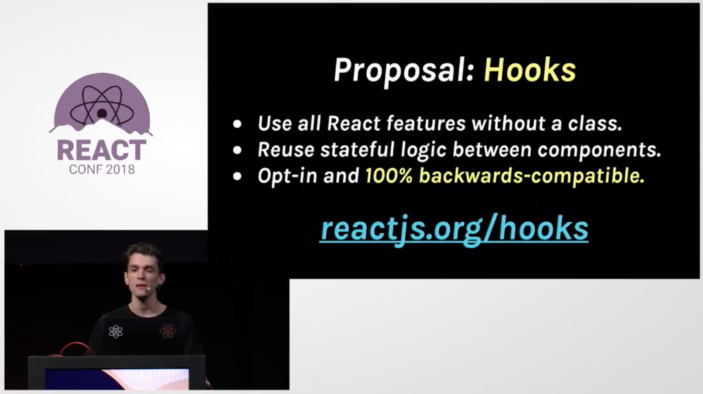

<p>
  <em>
    A couple of weeks ago, as of the writing of this article, <b>Dan Abramov</b>{" "}
    took onto the stage to introduce React Hooks to the React community at{" "}
    <b>React Conf 2018 in Henderson, Nevada</b>. And at first glance, I was
    encouraged for as much as it introduces new API, it makes it easy for React
    developers to use the same features we have been using for years but now,
    more efficiently and elegantly. Most importantly, they don’t introduce
    breaking changes and are 100% backward compatible.
  </em>
</p>



### So what exactly are Hooks?

Hooks are a new feature proposal that lets you use state and other React features without writing a class. That’s right! You can write a function component and have access to its local state and also its lifecycle methods 🎉🎉

They are currently in <b>React v16.7.0-alpha</b>; <a href="https://github.com/reactjs/rfcs/pull/68" target="_blank" rel="noreferrer">You can follow the discussions and developments here</a>.

### The motivation of introducing Hooks

Any API introductions should be backed up with motivation or reason as to “why,” and this is no different. Below are some of the reasons why;

<ul>
  <li>
    <b>Currently, it’s hard to use stateful logic between components</b>: If you
    have been using React for a while, you’d say that <b>HOC</b> and{" "}
    <b>Render Props</b> patterns do solve this problem, which is valid to some
    extent, but they do introduce some constraints and other pain points. For
    example, these patterns require you to restructure your components before
    you use them, and this can be cumbersome and make your code hard to follow.
    These patterns also introduce the “wrapper hell” where your components are
    wrapped in a long nested DOM. While this can be filtered out using React Dev
    tools, it’s not ideal.
  </li>
  <li>
    <b>Intricate components can be hard to understand:</b> React components
    usually start small, but with time they become complicated and big, which
    makes them hard to follow and understand. Each lifecycle method can have a
    bunch of unrelated logic that makes async calls to fetch some data, sets up
    event listeners, and cleans up these events when the component un-mounts.
    Based on the complexity of your application, all these can be a bit messy
    and hard to follow.
  </li>
  <li>
    <b>Classes are confusing to both people and computers: </b>Classes can be
    confusing to new React devs, and it’s one of the hindrances that some people
    are reluctant to learn React. For you to use classes, you have to understand
    how this works, and you have to bind your methods in the constructor, which
    can be a bit repetitive. Classes don’t get minified very well by dev tools,
    and they make hot reloading flaky and unreliable.
  </li>
</ul>

<blockquote>
  <p>
    We think Hooks are our best shot at solving all of these problems. Hooks let
    us organize the logic inside a component into reusable isolated units. —{" "}
    <b>Dan Abramov</b>
  </p>
</blockquote>

### Show me some code already!

Hooks are categorized into two categories: <b>Basic</b> and <b>Additional</b> Hooks.
I am going to demo <b>useState</b> and <b>useEffect</b>. Be sure to check the others out, for they will come in hand in your development work. I will write about the other hooks in subsequent series' of articles.

### State Hook

We'll create a controlled form input for setting a name.

```jsx:title controlled input {4}
import React from 'react';

const Counter = () => {
  const [name, setName] = React.useState('John Doe');

  const handleNameChange = (e) => setName(e.target.value);

  return (
    <div>
      <form>
        <label htmlFor="name">Your name</label>
        <input id="name" value={name} onChange={handleNameChange} />
      </form>
      <hr />
      <p>{`Your name is ${name}`}</p>
    </div>
  );
};
```

Draw your attention on the highlighted line of code which, shows the signature of the useState hook. It returns a destructured pair, the current value, and an updater function that lets you update that specific value. In this case, we have `name` and `setName`, which holds the current name value and updates the name, respectively. The useState hook takes an optional value, which will be its initial value. In this case, we have `John Doe`.

We then data-bind the input to the name value. We achieve this by passing the `name` to the value of the input field along with a synthetic-event `onChange` handler, as depicted below.

```jsx
<input id="name" value={name} onChange={handleNameChange} />
```

The `handleNameChange` function passes the value of the input to the `setName` updater function, which completes our two-way data-binding.

Below are some points to note when using useState;

- You can declare multiple useStates in your application as you'd like
- You can also pass a function to useState to lazy load a value; say reading a value from `localStorage`

### useEffect

This hook is used for making side effects like making API calls, subscriptions or manually changing the DOM in React components. This is the equivalent of componentDidMount, componentDidUpdate and componentWillUnmount but in a single unified API.

To demonstrate this, we will make an API call to the Star Wars API.

```jsx:title=useEffect {24-29}
import React, { useState, useEffect } from 'react';

export default function App() {
  const [data, setData] = useState([]);
  const [loading, setLoading] = useState(false);

  const controller = new AbortController();
  const signal = controller.signal;

  const fetchData = () => {
    setLoading(true);
    fetch('https://swapi.dev/api/people/1/', { signal })
      .then((res) => res.json())
      .then((data) => {
        setLoading(false);
        setData(data);
      })
      .catch((error) => {
        setLoading(false);
        console.error(error);
      });
  };

  useEffect(() => {
    fetchData();
    return () => {
      controller.abort();
    };
  }, []);

  return (
    <div className="App">
      <h1>Hello CodeSandbox</h1>
      <h2>Start editing to see some magic happen!</h2>
      {loading && <p>Loading...</p>}
      {!loading && <pre>{JSON.stringify(data, null, 2)}</pre>}
    </div>
  );
}
```

Draw your attention to the highlighted lines of code. We are calling the `useEffect` hook and passing it a callback function. The callback calls `fetchData` function which pulls data from an API hence causing a side effect.

The component might `unMount` before this function is settled, hence we `return` a clean up function which cancels the request using the `AbortController` API to avoid any memory leaks. We finally pass a dependancy for this function in our case, an empty `array`. This tells React to call this function only once on `Render`. This is the equivallent of `componentDidMount` when using `class` Components. If we didn't pass any dependacies, the function would be called over and over infinitely.

Below is the signature of `useEffect`;

```jsx:title=useEffect signature
useEffect(
  () => {
    /* Make side effects e.g;
     - subscriptions
     - API calls
     - DOM manipulation e.t.c

    */
    return () => {
      /* do some cleanup work like;
       - cancelling any unsettled network requests
       - unsubscribing to any subscriptions e.t.c
       */
    };
  },
  [
    /*dependacies*/
  ]
);
```

### Hook Rules

Hooks are Javascript functions and they come with some rules;

- Only call them at the top leavel. Don't call them inside loops, conditional statements or nested functions.
- Only call Hooks in React function components. Don't call them in normal JS functions. The only other place you can call them is in your custom hooks.

<thematicBreak />

### Why should I use Hooks?

Hooks allow you to write more cleaner code with less boilerplate. Below are some reactions from the community.

<Tweet
  tweetLink="https://twitter.com/rickhanlonii/status/1055579965540855808"
  align="center"
/>
<Tweet
  tweetLink="https://twitter.com/whoispriscilla/status/1055496514393403392"
  align="center"
/>
<Tweet
  tweetLink="https://twitter.com/mweststrate/status/1055532227939966976"
  align="center"
/>

### What next?

Hooks are awesome and they let you enjoy the same API's we've been using, only this time, with a little less code.

You can take this further by writting your custom hooks that you can re-use on your code base. There are more hooks that I haven't touched on here. You can <a href="https://reactjs.org/docs/hooks-overview.html#other-hooks" target="_blank" rel="noreferrer">learn more about them on here</a>.
