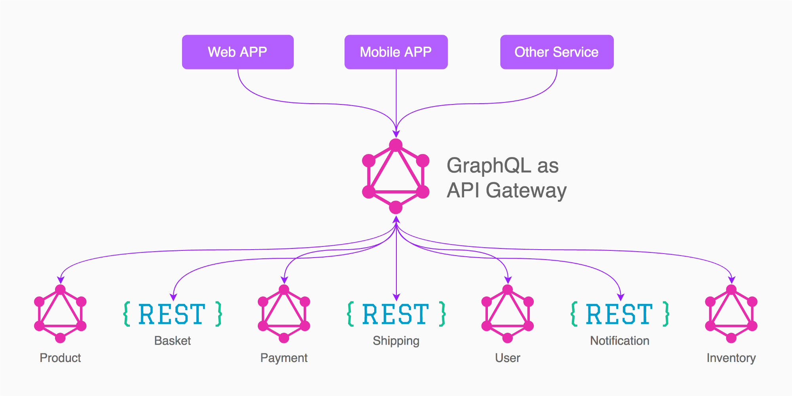

GraphQL has been, for the last couple of years, been one of the <em>hottest stack</em> in the tech scene and it has continued to be adopted by many companies for the benefits it brings. I can attest that it has some benefits that REST-based API's lack when you are building web and mobile applications. I am going to show you how you can start using GraphQL without changing your current architecture and with the least investment possible. Let’s get right to it.

### What we are going to build

We are going to build a graphql API from an existing REST API, in this case, the Star Wars API.


The API will have a PersonType and it will expose the following fields;

- Name
- Gender
- Vehicles
- Films
- Species
- Starships

Graphql is strongly typed, meaning, all fields must have a type that we expect to be returned. And with that, the above fields will each have a type depending on the shape of the returned value. We'll into types at a later stage.

### Schema and Types

With graphql APIs, we use types to describe how we want our data to look like and we can predict what the API will return.
The most basic components of a GraphQL schema are object types, which just represent a kind of object you can fetch from your service, and within it, you'll have fields.
There are special root types namely, Query, Mutation, and Subscriptions. These serve as entry points based on the type of operation you want to perform.

### Type System

Consuming a graphql API is basically selecting fields on an object. For instance, have a look at the below query;


We are querying for the `People` object along with its `name`, `gender` and `species` subfields.

> Tip: In our example, we omit the query name before the opening curly's but we can include it as well. If we were performing another operation along with the query, we'd have to include both root types.

### The code

You'll need to have node installed. If not, [download and install it here](https://nodejs.org/en/).
After you have succesfully installed node, follow the steps and commands below;

- [Download the source code](https://github.com/joeynimu/graphql-user-api) or run `https://github.com/joeynimu/graphql-user-api.git` from your terminal
- Change directory and install dependancies by running `cd graphql-user-api && npm install`
- Start the application by running `npm start` . At this point you should see be able to open the application on your browser at port 500 [`http://localhost:5000`](http://localhost:5000)


On visiting the forementioned url, you'll see graphiql; an in browser IDE that lets you explore a GraphQL API.
On the left hand side is where you write the query that you would like to execute, the middle is where your results will appear and on the right is a documentation that allows you to see the available fields to query.

So lets go ahead and copy the below query and paste it on the query section (left hand side)

```graphql:title Query
{
  People {
    name
    gender
    vehicles
    films
    species
    starships
  }
}
```


And there you have it! You have just queried for data in graphql API 🎉🎉

We have one last query for getting a specific person by passing an `ID` parameter. We'll use the query below;

```graphql
{
  Person(id: "1") {
    name
    gender
    vehicles
    films
    species
    starships
  }
}
```

### Conclusion

At this point we have created a GraphQL API using an existing REST API without changing its underlying code or infrastructure. I hope you have gotten a basic idea of how you can start using GraphQL with the least investment and risk possible. Have a look at the code and see how you can adopt and implement this pattern on your own API’s and extend it even further by adding more functionality.
We have only used the Query operation on this example but graphql offers two more operations;

- [**Mutations**](https://graphql.org/learn/queries/#mutations): For Creating, Updating and Deleting data
- [**Subscriptions**](https://graphql.org/blog/subscriptions-in-graphql-and-relay/): For realtime data.

You can also build an API gateway (One Graph) from multiple underlying APIs using [graphql federation](https://www.apollographql.com/docs/apollo-server/federation/introduction). This is useful if you have a micro-service based architecture so be sure to that that out as well.
